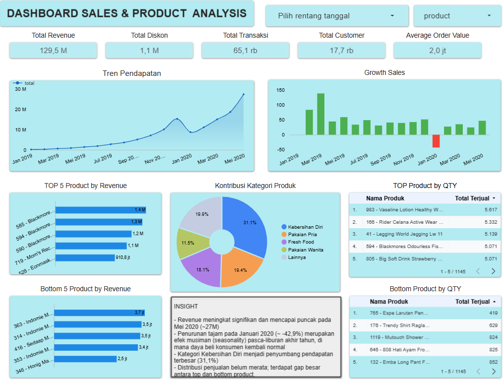

# Sales & Product Performance Analysis (Jan 2019 - Mei 2020)

Data ini berisi analisis performa penjualan bisnis retail atau e-commerce pada periode Januari 2019 - Mei 2020.

---

## 📌 1. Project Overview & Business Problem
Proyek ini bertujuan untuk menganalisis performa penjualan bisnis ritel/e-commerce selama periode Januari 2019 hingga Mei 2020. Analisis ini berfokus pada pelacakan tren pendapatan (*revenue growth*), identifikasi produk unggulan (*Top/Bottom Products*), serta kontribusi setiap kategori produk terhadap total bisnis. 

Hasil analisis ini diharapkan dapat membantu tim Manajemen, Marketing, dan Inventory dalam mengambil keputusan strategis berbasis data untuk periode berikutnya.

---
### 📋 Dataset Schema (Struktur Data Utama)
Proyek ini mengolah data transaksi *e-commerce* berskala besar yang terdiri dari 4 tabel utama. Untuk efisiensi analisis, fokus pengolahan dilakukan pada kolom-kolom kunci berikut:

* **`orders`**: Menampung data transaksi makro (Kolom kunci: `order_id`, `buyer_id`, `paid_at`, `delivery_at`).
* **`order_details`**: Menampung detail item per transaksi (Kolom kunci: `order_id`, `product_id`, `price`, `quantity`).
* **`products`**: Master data produk (Kolom kunci: `product_id`, `desc_product`, `category`).

---

## 🛠️ 2. Data Preparation & Cleaning

Proses pengolahan data dilakukan menggunakan Google Cloud BigQuery untuk mengubah data mentah (*raw data*) menjadi tabel yang valid, konsisten, dan siap digunakan untuk kebutuhan visualisasi:

1. **Standardisasi Tipe Data ID & Kode Pos (`CAST AS STRING`)**
   * **Tindakan:** Mengubah tipe data seluruh kolom kunci/relasional (`order_detail_id`, `order_id`, `product_id`, `seller_id`, `buyer_id`, `user_id`) dan `kodepos` menjadi tipe `STRING`.
   * **Alasan:** Kolom identitas bukanlah data numerik yang akan dihitung secara matematis. Mengubahnya menjadi string mencegah terjadinya galat (*error*) dan memastikan proses penggabungan tabel (*table joining*) berjalan dengan mulus.

2. **Validasi Format Tanggal (`SAFE_CAST`)**
   * **Tindakan:** Mentransformasi kolom `paid_at` dan `delivery_at` menjadi tipe data `DATE` menggunakan fungsi `SAFE_CAST`.
   * **Alasan:** Menghindari kegagalan query (*runtime error*) akibat adanya data tanggal yang korup atau tidak valid pada tabel asal. Fungsi ini akan mengubah format yang salah menjadi `NULL` secara aman.

3. **Normalisasi & Pembersihan Teks (`TRIM` & `INITCAP`)**
   * **Tindakan:** Mengaplikasikan kombinasi fungsi `INITCAP(TRIM(desc_product))` pada deskripsi produk.
   * **Alasan:** Menghapus spasi kosong yang tidak diinginkan di awal/akhir kalimat (`TRIM`) serta menstandardisasi format penulisan nama produk menjadi huruf kapital di setiap awal kata (`INITCAP`) agar visualisasi pada dasbor terlihat rapi dan seragam.

4. **Filtrasi Transaksi Valid (`WHERE IS NOT NULL`)**
   * **Tindakan:** Menyaring data transaksi dengan kondisi `where paid_at is not null and delivery_at is not null`.
   * **Alasan:** Memastikan metrik finansial seperti pendapatan (*revenue*) dan volume penjualan hanya dihitung dari transaksi yang benar-benar sukses dibayar dan berhasil dikirim ke pelanggan.

5. **Otomatisasi Skema Berulang (`CREATE OR REPLACE`)**
   * **Tindakan:** Menggunakan perintah `CREATE OR REPLACE TABLE / VIEW` untuk setiap tahapan.
   * **Alasan:** Membangun *pipeline* data yang bersifat *idempotent* (dapat dijalankan berulang kali secara otomatis) tanpa risiko *error* akibat tabel yang sudah ada sebelumnya.

---

## 📈 3. Key Performance Indicators (KPI)
Berdasarkan data yang telah diolah, berikut adalah ringkasan performa bisnis makro selama periode analisis (17 bulan):

| Metrik KPI | Nilai | Deskripsi |
| :--- | :---: | :--- |
| **Total Revenue** | **Rp 129,5 M** | Total pendapatan kotor selama periode analisis. |
| **Total Transactions** | **65,1 rb** | Jumlah total order/transaksi yang berhasil diproses. |
| **Total Customers** | **17,7 rb** | Jumlah pelanggan unik (*unique buyers*) yang bertransaksi. |
| **Average Order Value (AOV)** | **Rp 2,0 jt** | Rata-rata nilai belanja per satu kali transaksi. |
| **Total Discount Given** | **Rp 1,1 M** | Total potongan harga yang diberikan kepada konsumen. |

---

## 🔍 4. Key Insights & Deep Dive Analysis

### A. Tren Pendapatan & Efek Musiman (*Seasonality*)
* **Pertumbuhan Eksponensial:** Tren pendapatan menunjukkan pertumbuhan yang masif dan mencapai puncaknya pada **Mei 2020** dengan pendapatan menyentuh **~Rp 27 Miliar**.
* **Anomali Awal Tahun (*Post-Holiday Slump*):** Terjadi penurunan tajam pada **Januari 2020 (-42,9%)**. Penurunan ini diidentifikasi sebagai efek musiman (*seasonality*) yang wajar pasca-liburan akhir tahun.

### B. Analisis Kategori & Performa Produk
* **Kategori Dominan:** Kategori **Kebersihan Diri** merupakan *revenue driver* terbesar bagi bisnis, berkontribusi sebanyak **31,1%** dari total pendapatan.

#### 📊 Tabel Perbandingan Produk (Revenue vs Volume)

| Kategori Analisis | Top Performance | Bottom Performance |
| :--- | :--- | :--- |
| **Berdasarkan Revenue** | **Suplemen Kesehatan** (seperti *Blackmores*) mendominasi Top 5 Revenue. • *Kontribusi:* **> Rp 1,1 M - Rp 1,4 M** per produk. | **Mi Instan** (seperti *Indomie & Sedaap*) berada di Bottom 5. • *Kontribusi:* **< Rp 3,7 Juta** per produk. |
| **Berdasarkan Volume (QTY)** | **Kebersihan Diri & Pakaian** (seperti *Vaseline Lotion* & *Rider Celana 3in1*). • *Total Terjual:* **> 5.300 unit**. | **Minuman & Pakaian** (seperti *Espe Larutan Penyegar* & *Trendy Shirt Raglan*). • *Total Terjual:* **< 630 unit**. |

## 📊 Dashboard Preview

*Tip: Klik gambar di atas untuk mengakses dasbor interaktif di Looker Studio.*

---

## 💡 5. Business Recommendations

* **Strategi Antisipasi *Post-Holiday Slump*:** Tim Marketing disarankan membuat kampanye khusus di awal tahun (misalnya: *New Year Resolution Promo* atau diskon bundling khusus Januari) untuk menjaga stabilitas transaksi agar tidak merosot tajam pasca-Desember.
* **Optimalisasi Kategori Kebersihan Diri:** Meningkatkan ketersediaan stok (*inventory level*) dan memperluas variasi produk pada kategori Kebersihan Diri, karena kategori ini memiliki minat pasar (*market share*) tertinggi (**31,1%**).
* **Evaluasi *Bottom Products*:** Melakukan evaluasi mendalam terhadap produk mi instan dan barang-barang di kategori *Bottom 5*. Perlu dianalisis apakah marginnya terlalu kecil atau kalah bersaing secara harga, sehingga bisa diputuskan untuk retur ke *supplier* atau diberikan promo *bundling* dengan produk *Top Performance*.

